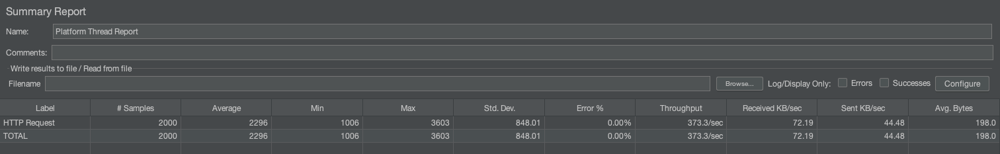
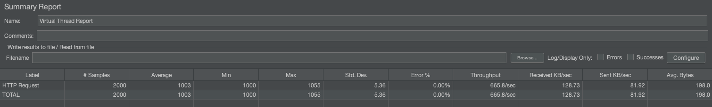

# Spring Boot Platform Thread vs Virtual Thread Comparison

This project demonstrates the performance difference between traditional platform threads and Java's virtual threads in a Spring Boot application.

## Project Structure

The project consists of two Spring Boot applications:
- `platform-thread`: Uses traditional platform threads
- `virtual-thread`: Uses Java's virtual threads (Project Loom)

## Running the Applications

Both applications can be started simultaneously using the provided script:

```bash
./run-both.sh
```

This script will:
1. Kill any processes running on ports 8081 and 8082 (if they exist)
2. Start the platform-thread application on port 8081
3. Start the virtual-thread application on port 8082

## Load Testing

A JMeter test plan is included to compare the performance of both applications:

1. Install Apache JMeter from https://jmeter.apache.org/
2. Open JMeter and load the `load-test.jmx` file
3. Run the test to see the throughput comparison between platform threads and virtual threads

The test plan sends 2000 concurrent requests to each application:
- Platform Thread: http://localhost:8081/block
- Virtual Thread: http://localhost:8082/non-block

## Results Comparison

### Platform Thread Performance


### Virtual Thread Performance


As shown in the images above, virtual threads typically provide better throughput and lower latency compared to platform threads, especially under high concurrency.

# Analysis: Platform Threads vs. Virtual Threads

In short, these results clearly demonstrate that **Virtual Threads deliver vastly superior, more stable, and more efficient performance** compared to Platform Threads for this I/O-bound workload.

### Head-to-Head Metric Comparison

| Metric            | Platform Thread Report | Virtual Thread Report | Analysis                                                                                                                             |
| :---------------- | :--------------------- | :-------------------- | :----------------------------------------------------------------------------------------------------------------------------------- |
| **Average (ms)** | 2296                   | **1003** | The average response time is **2.3x faster** with Virtual Threads. Platform Threads show significant queueing time and overhead.       |
| **Std. Dev. (ms)**| 848.01                 | **5.36** | The standard deviation is **158x lower** on Virtual Threads. This is the most significant difference, indicating **extremely stable and predictable performance**. |
| **Throughput (/sec)**| 373.3                  | **665.0** | Virtual Threads handled **~78% more requests per second**. This shows far greater efficiency.                                       |
| **Error %** | 0.00%                  | 0.00%                 | Both completed all requests, but the quality of service was vastly different.                                                      |

### Analysis of the Results

#### Platform Thread Report (Poor Performance) 📉

This report shows the classic symptoms of a system struggling under load, even with no explicit errors.

* **High Response Time (2296 ms):** The extra ~1.3 seconds on top of the ideal 1-second response time is time the requests spent waiting in a queue before being processed.
* **Very Low Stability (Std. Dev. 848.01):** This extremely high standard deviation is a major red flag. It means the user experience is highly inconsistent; some users might get a response in 1 second, while others wait up to 3.6 seconds.
* **Limited Throughput (373.3/sec):** The system has hit its limit for managing heavyweight threads, preventing it from processing requests as quickly as the virtual thread-based system.

#### Virtual Thread Report (Excellent Performance) ✅

This report illustrates a healthy, efficient, and scalable system.

* **Ideal Response Time (1003 ms):** The average time is only slightly above the simulated I/O work (1000 ms), which means there was **almost no queueing time**. Every request was served immediately.
* **Extremely Stable (Std. Dev. 5.36):** This incredibly low value is the hallmark of a high-performance, predictable system. Nearly every user gets the exact same experience.
* **High Throughput (665.0/sec):** Due to minimal overhead, the system can efficiently use its CPU resources to get more work done in the same amount of time.

### Conclusion

This comparison is a perfect demonstration of the advantages of Virtual Threads. Platform Threads, even in large numbers, create a bottleneck due to their heavyweight nature and the expensive cost of managing them by the operating system. In contrast, lightweight Virtual Threads allow tens of thousands of connections to be handled concurrently without overwhelming the system, resulting in **low latency, high stability, and far superior throughput.**

This makes them particularly well-suited for applications with high concurrency needs, such as web servers and microservices.